# 🤖 BotLangChain

> A smart, human-in-the-loop AI agent built with LangChain, LangGraph, and Groq.

BotLangChain is an intelligent email processing agent designed to handle customer support tasks, specifically focusing on refund requests. It leverages the power of Large Language Models (LLMs) to understand email context and autonomously draft actions, while ensuring safety and accuracy through a human-in-the-loop approval mechanism.

## ✨ Features

- **📧 Intelligent Email Parsing**: Fetches and understands context from emails (simulated).
- **💸 Refund Processing**: Identifies refund requests and prepares them for processing.
- **🛡️ Human-in-the-Loop**: Pauses execution for critical actions (like refunds) to require human approval via a CLI interface.
- **🧠 State Management**: Uses `LangGraph` for robust state handling and resuming interrupted workflows.
- **⚡ Powered by Groq**: Utilizes high-performance inference for quick responses.

## 🛠️ Tech Stack

- **Runtime**: Node.js
- **Framework**: [LangChain](https://js.langchain.com/), [LangGraph](https://langchain-ai.github.io/langgraphjs/)
- **LLM Provider**: [Groq](https://groq.com/) (OpenAI compatible API)
- **Validation**: [Zod](https://zod.dev/)
- **CLI UI**: `marked`, `marked-terminal`

## 🔄 Workflow

```mermaid
graph TD
    A[Start Agent] --> B{Check Input}
    B -->|User Query| C[Agent Processing]
    C --> D{Tool Call Needed?}
    D -->|No| E[Respond to User]
    D -->|Yes| F[Select Tool]
    F --> G{Is Tool 'Refund'?}
    G -->|No| H[Execute Tool]
    H --> C
    G -->|Yes| I[⏸️ Pause for Approval]
    I --> J{User Decision}
    J -->|Approve| K[✅ Execute Refund]
    J -->|Reject| L[❌ Cancel Action]
    K --> C
    L --> C
```



## 🚀 Getting Started

### Prerequisites

- Node.js (v18+ recommended)
- A Groq API Key

### Installation

1.  **Clone the repository**
    ```bash
    git clone https://github.com/priyanshu-samal/botLangChain.git
    cd botLangChain
    ```

2.  **Install dependencies**
    ```bash
    npm install
    ```

3.  **Configure Environment**
    Create a `.env` file in the root directory and add your keys:
    ```env
    GROQ_API_KEY=your_groq_api_key_here
    ```

### Usage

Run the development agent:

```bash
npm run dev
```

**Interacting with the Agent:**
1.  The agent will start and prompt `You:`.
2.  Type a query like: *"Is there any refund request?"*
3.  The agent will analyze the (mock) emails.
4.  If it finds a refund request, it will attempt to call the `refund` tool.
5.  **INTERRUPT**: The agent will pause and show you the proposed action.
6.  Type `1` to **Approve** or `2` to **Reject**.
7.  The agent will resume based on your decision.

## 📂 Project Structure

- `agent.js`: Main entry point containing the agent logic, tools, and interactive loop.
- `package.json`: Project dependencies and scripts.

## 🤝 Contributing

Contributions are welcome! Please feel free to submit a Pull Request.
